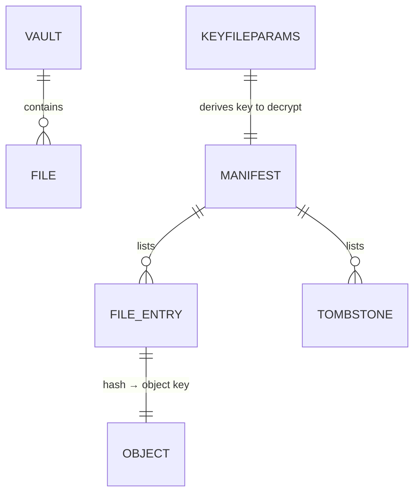

# Data Model

Authoritative definitions of the artifacts Syncrypt reads and writes. Formats are
specified normatively in [RFC-0004](../rfc/RFC-0004-Synchronization-Engine.md)
(manifest) and [RFC-0005](../rfc/RFC-0005-Encryption-Model.md) (encryption).

## Entities

### Vault
The set of local files under sync, filtered by the active **sync profile**. The
vault is the source of truth (ADR-0004).

### FileDescriptor
Computed per file during a scan:

```ts
interface FileDescriptor {
  path: string;   // canonical, NFC-normalized (ADR-0007)
  hash: string;   // e.g. "b3:<hex>" over PLAINTEXT bytes
  size: number;   // plaintext size in bytes
  mtime: number;  // epoch seconds — advisory only
}
```

### Manifest
The coordination document (encrypted at rest). See RFC-0004 for the full schema.
Key fields: `version`, `generation` (monotonic commit counter), `device`,
`updatedAt`, `files: Record<path, {hash,size,mtime}>`, `tombstones`.

### Tombstone
A record that a path was deleted: `{ deletedAt, device }`. Retained for a grace
window, then GC'd along with unreferenced objects.

### Object
An encrypted blob in `objects/`. Key derived per RFC-0005 (default:
`HMAC-BLAKE3(NameKey, contentHash)`). Self-describing format:
`magic|version|alg|nonce|ciphertext|tag`.

### KeyfileParams
Non-secret KDF material stored at `meta/keyfile-params.json`:
`{ kdf: "argon2id", salt, memoryKiB, iterations, parallelism, version }`.
Enables a new device to derive the master key from the passphrase alone.

## Relationships



## State a device keeps

- **Local base**: last successfully synced manifest (generation + file table).
  A cache, not truth. If lost, rebuild by treating remote manifest as base and
  re-hashing the vault.
- **Session secrets (memory only)**: passphrase-derived master key and subkeys.
  Never persisted to plaintext files or logs.
