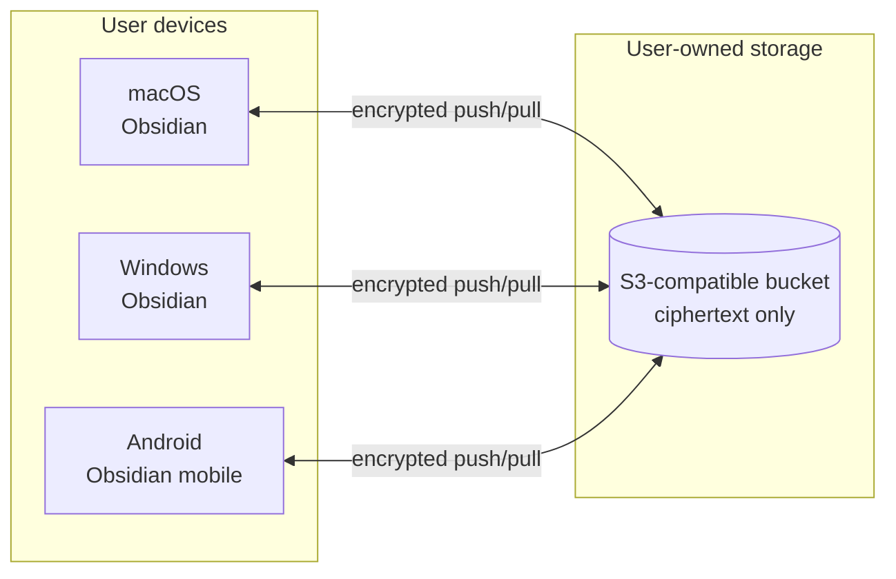
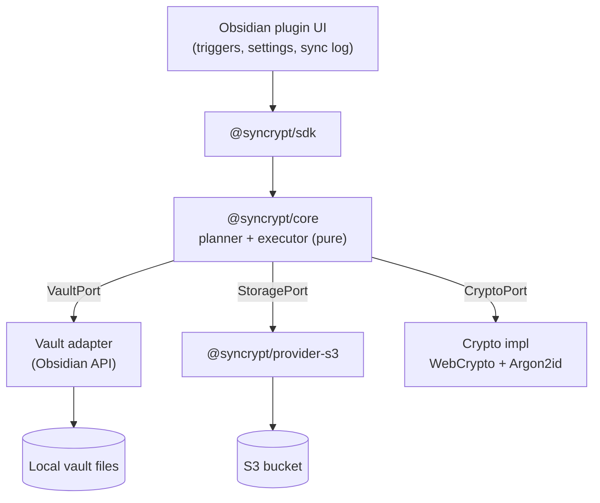
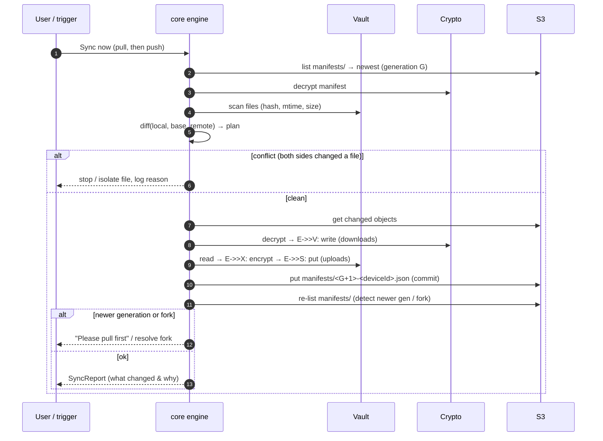

# Architecture Overview

A living, diagram-first overview. Normative detail lives in the RFCs; this page is
the map. See [RFC-0003](../rfc/RFC-0003-Architecture.md) for the authoritative
version.

## System context

Each device runs the same engine. The bucket is untrusted and holds only
encrypted objects and an encrypted manifest. There is **no Syncrypt server**.

## Component layering

The engine is pure and depends only on **ports**. Concrete adapters (Obsidian
vault, S3 provider, crypto) are injected. This is what makes the decision logic
unit-testable and portable to Android.

## One sync, end to end

## What gets synced

Three categories (see [configuration](../user-guide/configuration.md)):

1. **Content — always.** `*.md`, `Attachments/`, `Canvas/` (`*.canvas`),
   Excalidraw.
2. **Config — selective.** Chosen files from `.obsidian/` (snippets, community
   plugin list, specific plugin data) via an include/exclude profile.
3. **Excluded — never.** Volatile/machine state: `.obsidian/cache`,
   `workspace.json`, `workspaces.json`, `app.json` device specifics.

## Compatibility matrix

| Concern | macOS (desktop) | Windows (desktop) | Android (mobile) |
|---|---|---|---|
| Runtime | Electron/Node available | Electron/Node available | Obsidian mobile sandbox, **no Node APIs** |
| Crypto | WebCrypto + native/WASM Argon2id | same | WebCrypto + **WASM** Argon2id |
| Auto-sync while active | frequent (not power/data constrained) | frequent | debounced + min-interval + Wi-Fi-only, **foreground only** |
| Background sync | best-effort on close | best-effort on close | best-effort push on background; **no daemon** |
| Filesystem | case-insensitive, **NFD** paths | case-insensitive, NFC | case-sensitive, NFC |
| Large files | multipart upload | multipart upload | mind memory/data limits |

Implications: shared `core`/`sdk` code must avoid Node-only APIs; path handling is
normalized centrally ([ADR-0007](../adr/ADR-0007-Unicode-Path-Normalization.md));
never assume a background daemon (especially on Android).

## Key invariants (must always hold)

- **No silent overwrite.** Both-sides-changed ⇒ conflict, never a blind write.
- **Manifest is the commit point,** published last, atomically (ADR-0006).
- **Storage s