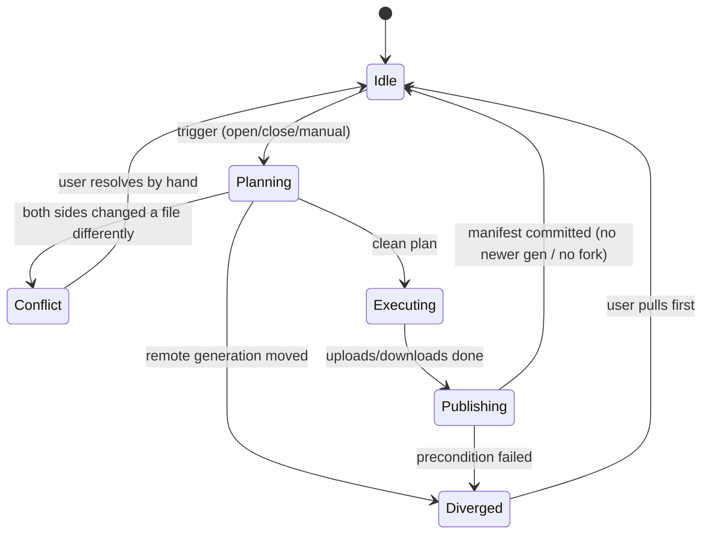

# Sync Flow (detailed)

Companion to [RFC-0004](../rfc/RFC-0004-Synchronization-Engine.md). This page
walks the states and the decision table with worked examples.

## States

## Decision table (recap)

`local` vs `base` vs `remote` (⌀ = absent, † = tombstone):

| local | base | remote | op |
|---|---|---|---|
| A | A | A | none |
| B | A | A | Upload B |
| A | A | B | Download B |
| B | A | B(=local) | none (reconcile) |
| B | A | C | **Conflict** |
| ⌀ | A | A | DeleteRemote (tombstone) |
| A | A | † | DeleteLocal |
| B | ⌀ | ⌀ | Upload B (new local) |
| ⌀ | ⌀ | B | Download B (new remote) |
| B | ⌀ | C | **Conflict** (same path created independently) |
| ⌀ | A | † | none (converge) |

## Worked example: the three-device loop

1. **Windows** edits `Projects/ATM.md`, pushes → objects uploaded, manifest
   `generation 42→43`.
2. **macOS** opens Obsidian → pull: sees remote generation 43 > base 42, downloads
   the one changed object, applies it, sets base=43. Log:
   *"Projects/ATM.md — remote version is newer → downloaded."*
3. **Android** opens later → same pull, one object downloaded. No background daemon
   needed.
4. **macOS** deletes `Old/Deprecated.md`, pushes → tombstone written, generation
   43→44.
5. **Windows** pull → *"Old/Deprecated.md — file marked as deleted in manifest →
   removed locally."*

## Worked example: a conflict

- **Windows** and **macOS** both edit `Ideas.md` while offline.
- Windows pushes first (generation 44→45).
- macOS pushes: fetches manifest, sees `Ideas.md` changed on both sides to
  different hashes → **Conflict**. macOS does **not** overwrite. It writes
  `Ideas (conflicted copy from windows-01 2026-07-16).md` next to the local file
  and logs the reason. The user merges by hand and syncs again.

No data is lost; nothing is merged automatically. This is the core safety promise.
