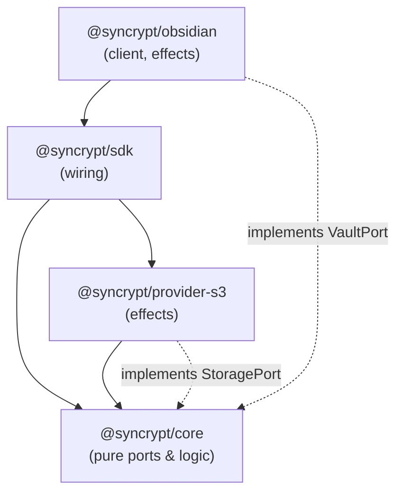
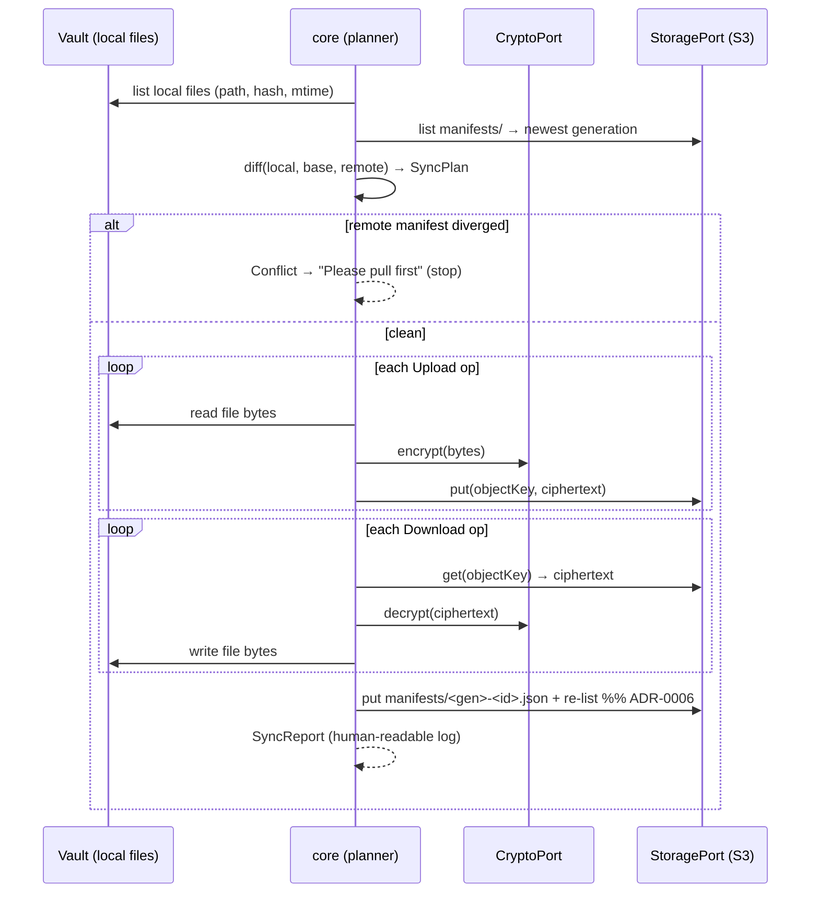

# RFC-0003: Architecture

- **Status:** Accepted
- **Author(s):** Dmitriy (project author)
- **Created:** 2026-07-16
- **Related ADRs:** ADR-0002, ADR-0004, ADR-0005

## Summary

Syncrypt is a layered monorepo: a platform-agnostic **core** engine, a thin
**SDK** facade, pluggable **storage providers**, and client integrations (the
Obsidian plugin first). The core is pure and deterministic; all I/O (filesystem,
network, crypto side effects, clock) is injected at the edges. This keeps the
sync logic testable and portable across desktop and Android.

## Goals of this architecture

- Isolate the **decision logic** (what to sync) from **effects** (reading files,
  talking to S3, encrypting bytes) so decisions are unit-testable in memory.
- Make the **storage backend** replaceable behind one interface (RFC-0006).
- Make the **client** (Obsidian) replaceable behind a `VaultAdapter`.
- Ship the same core to desktop and mobile without Node-only dependencies.

## Package layout

```
packages/
├── core/             # @syncrypt/core — pure engine: manifest, diff, planner, executor
├── sdk/              # @syncrypt/sdk — public API that wires core + provider + adapter
├── obsidian-plugin/  # @syncrypt/obsidian — Obsidian client (desktop + mobile)
└── providers/
    └── s3/           # @syncrypt/provider-s3 — S3-compatible StorageProvider
```

### `@syncrypt/core` (pure, no I/O)

Responsibilities:

- **Manifest** model: parse/serialize, compare, merge tombstones.
- **Change detection**: given a list of local file descriptors (path, hash,
  mtime, size) and a base manifest, compute local changes.
- **Diff / planner**: given local state, base manifest, and remote manifest,
  produce a **SyncPlan** — an ordered list of operations
  (`Upload`, `Download`, `DeleteLocal`, `DeleteRemote`, `Conflict`).
- **Executor**: run a SyncPlan against injected ports, producing a **SyncReport**
  (the human-readable log).

Core depends on **ports** (interfaces), never on concrete implementations:

```
StoragePort   — get/put/list/delete/stat (+ optional conditional write) (RFC-0006)
VaultPort     — read/write/list/delete files in the local vault
CryptoPort    — encrypt/decrypt bytes, derive key, hash (RFC-0005)
ClockPort     — now() (injected for deterministic tests)
LogPort       — structured, human-readable sync log
```

### `@syncrypt/sdk`

Wires a concrete provider, vault adapter, crypto implementation and config into a
ready-to-use `SyncEngine`. Exposes `push()`, `pull()`, `sync()`, `dryRun()`,
`status()`. This is the surface a client (or a CLI, later) consumes.

### `@syncrypt/obsidian`

Implements `VaultPort` via the Obsidian API, provides settings UI, sync triggers
(on open/close, manual), and renders the sync log. Must stay within Obsidian
mobile constraints (see [compatibility matrix](../architecture/overview.md#compatibility-matrix)).

### `@syncrypt/provider-s3`

Implements `StoragePort` against S3-compatible storage: `put`, `get`, `list`,
`delete`, `stat`. Manifest concurrency uses only the universal `list`+`put`+`get`
subset (immutable generation objects + fork detection, ADR-0006); **conditional
writes** (ETag / `If-Match` / `If-None-Match`), where the vendor supports them,
are an optional fast path.

## Dependency direction



Arrows point toward abstractions. **Nothing in `core` imports a concrete
provider or client.** Effects depend on core, never the reverse.

## High-level data flow (one sync)



Details of the manifest and the diff live in
[RFC-0004](./RFC-0004-Synchronization-Engine.md); the encryption boundary in
[RFC-0005](./RFC-0005-Encryption-Model.md); the storage contract in
[RFC-0006](./RFC-0006-Storage-Provider-API.md).

## Storage layout (per vault, in the bucket)

```
<prefix>/
├── manifest.json            # encrypted manifest (see RFC-0005 for path handling)
├── objects/                 # content-addressed or path-mapped encrypted blobs
│   └── <object-key>
└── meta/
    └── keyfile-params.json  # KDF params + salt (NOT the key) — see RFC-0005
```

The exact object-key strategy (content-addressed vs. path-mapped) is specified in
RFC-0004 §Object keys, with the privacy trade-off analyzed in RFC-0005.

## Error & safety model

- **Fail closed.** Any of: crypto auth-tag failure, unreadable manifest,
  ambiguous divergence → **stop**, log, and ask the user. Never guess.
- **Atomic manifest publish.** The manifest is the commit point. It is written
  **after** all object uploads succeed, as an immutable per-generation object;
  a `list` + fork check (portable to any S3) ensures two devices cannot clobber
  each other (ADR-0006).
- **Idempotent operations.** Re-running an interrupted sync converges; a
  half-finished sync leaves objects uploaded but the manifest un-advanced, so the
  next run simply completes.

## Portability constraints

- `core` and `sdk` MUST NOT use Node-only APIs; crypto and storage are behind
  ports so a mobile-safe implementation can be injected on Android.
- Filesystem semantics differ across platforms (case sensitivity, Unicode
  normalization). Path handling is normalized centrally — see
  [ADR-0007](../adr/ADR-0007-Unicode-Path-Normalization.md).

## Unresolved questions

- Object-key strategy final choice (privacy vs. dedup) — tracked in RFC-0004/0005.
- Whether the SDK also ships a headless CLI in v1 (useful for testing and
  hand-recovery) or post-1.0.
